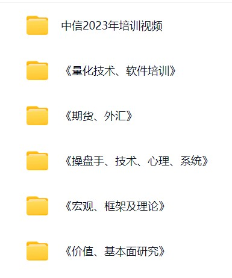

# 未来工作方向

## 学术相关建议

要获得更深入的见解，推荐Marcos López de Prado的“金融机器学习的进展”，并探索QuantInsti博客和SSRN研究论文等资源，这些资源涵盖了量化金融的最新发展。

## 同行资源

1.中金培训资料

百度网盘：[中金培训资料](https://pan.baidu.com/s/1eFm28MQ3_Pzd-hOrX40Gig) 提取码: 0406

2.Qbot工作借鉴

分析：
可以用于**预测股市走势**的算法包括以下几类：

### 机器学习和深度学习算法

1. **GBDT（梯度提升决策树）**
   - XGBoost
   - LightGBM
   - Catboost
   - BOOST（如 DoubleEnsemble, TabNet）

2. **RNN（递归神经网络）**
   - CNN（卷积神经网络）
     - MLP（多层感知机）
     - GRU（门控循环单元）
     - ImVoxelNet
     - TabNet
   - RNN（递归神经网络）
     - LSTM（长短时记忆网络）
     - ALSTM（注意力LSTM）
     - ADARNN（自适应动态RNN）
     - KRNN
     - Sandwich

3. **强化学习（Reinforcement Learning）**
   - TFT（时间特征转换器）
   - GATs（图注意力网络）
   - SFM（因子时序建模）

4. **Transformer**
   - Transformer（神经网络模型）
   - TCTS（基于时间序列的Transformer）
   - TRA（时间相关注意力）
   - TCN（时间卷积网络）
   - IGMTF（智能多因子时序预测）
   - HIST（历史信息融合）
   - Localformer

5. **大语言模型（LLM）**
   - ChatGPT（可以用于情绪分析、新闻数据分析）
   - FinGPT（金融特化的GPT，可用于市场预测）
