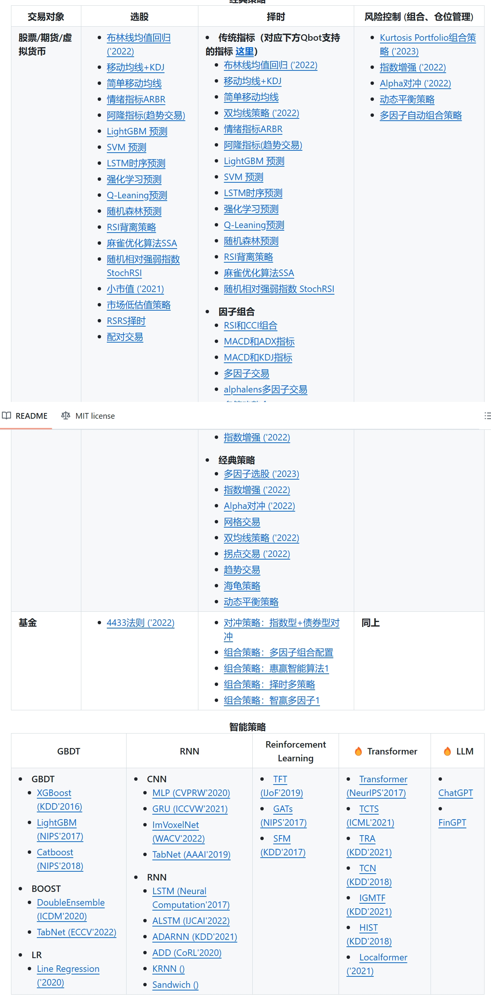

# 未来工作方向

## 学术相关建议

要获得更深入的见解，推荐Marcos López de Prado的“金融机器学习的进展”，并探索QuantInsti博客和SSRN研究论文等资源，这些资源涵盖了量化金融的最新发展。

## 同行资源

1.中金培训资料

百度网盘：[中金培训资料](https://pan.baidu.com/s/1eFm28MQ3_Pzd-hOrX40Gig) 提取码: 0406

2.Qbot工作借鉴

